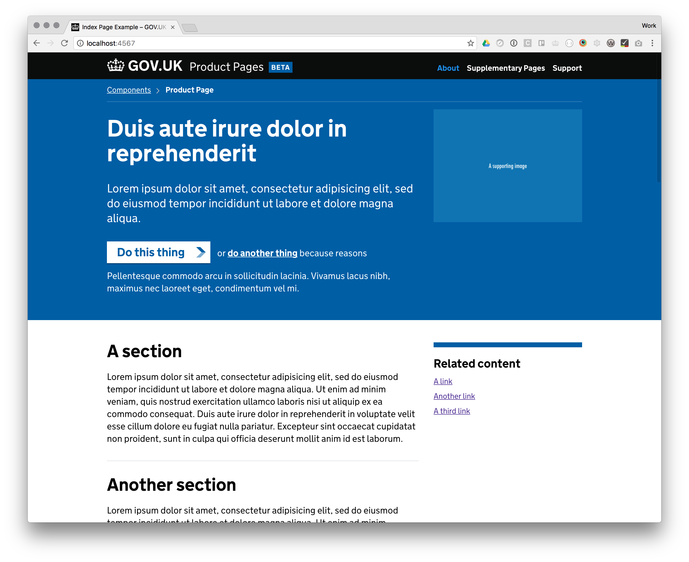

# Product Page Example

This repository contains a number of [components](#components) that can be used
to build 'product pages' for GOV.UK Products like [GOV.UK Pay], [GOV.UK
Notify] and [GOV.UK Registers].

It is also a [middleman site](http://middlemanapp.com/) for the sole purpose of
providing an _example_ of how to use the components to build a site. You do not
have to use middleman to build your product page.

This shares a number of components and design considerations with the [tech docs
template](https://github.com/alphagov/tech-docs-template), which may also be
useful for product teams.

## Components

For documentation on each component, read the comments at the top of each
component's stylesheet:

- [Breadcrumbs](source/stylesheets/modules/_breadcrumbs.scss)
- [Content Section](source/stylesheets/modules/_content-section.scss)
- [Full Width Form](source/stylesheets/modules/_full-width-form.scss)
- [GOV.UK Logo](source/stylesheets/modules/_govuk-logo.scss)
- [Header](source/stylesheets/modules/_header.scss)
- [Hero 'Alternative Action'](source/stylesheets/modules/_hero-alternative-action.scss)
- [Hero Button](source/stylesheets/modules/_hero-button.scss)
- [Masthead](source/stylesheets/modules/_masthead.scss)
- [Phase Banner](source/stylesheets/modules/_phase-banner.scss)
- [Related Items](source/stylesheets/modules/_related-items.scss)
- [Skip Link](source/stylesheets/modules/_skip-link.scss)
- [Sub Navigation](source/stylesheets/modules/_sub-navigation.scss)

## Usage

For now, please copy the Sass and Javsacript for the components that you require
into your own project, and use your own asset pipeline to e.g. compile the Sass
files into CSS.

Because each product team have their own tech stack, making these dependencies
available in a more automated way that worked for everyone was not part of the
MVP, but it's something we're looking at for the future.

## Frontend Dependencies

[GOV.UK Frontend] and [GaaP Analytics] are included using [NPM] and bundled in
on build. You can include more [NPM] modules easily by installing them as a 
dependency and including paths to them. This works because within [config.rb](https://github.com/alphagov/product-page-example/blob/master/config.rb#L64) sprockets is instructed to look within
`node_modules/`.

### Getting started with Google Analytics
To get started with Google Analytics you will need an account and a tracking ID
you can get these by talking to the GaaP programme team. The analytics ID is then
set within [config.rb](https://github.com/alphagov/product-page-example/blob/master/config.rb#L34).

To learn about how to get started with event tracking head over to [GaaP Analytics].

## Running Example Locally

If you wish to run the example in your own browser, you'll need to run the
following commands from the root of this project:

- `bundle install` to install middleman and its dependencies
- `npm install` to install the frontend dependencies
- `bundle exec middleman server` - to start middleman's built in server
- `open http://localhost:4567` - to open the example in your browser

[GOV.UK Pay]: https://www.payments.service.gov.uk/
[GOV.UK Notify]: https://www.notifications.service.gov.uk/
[GOV.UK Registers]: https://registers.cloudapps.digital/

[GOV.UK Frontend]: https://github.com/alphagov/govuk-frontend
[GaaP Analytics]: https://github.com/alphagov/gaap-analytics
[NPM]: https://npmjs.com
